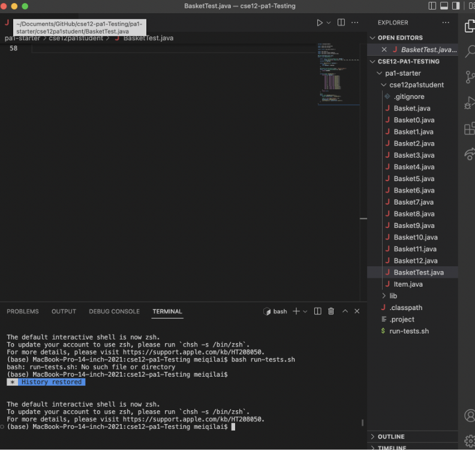
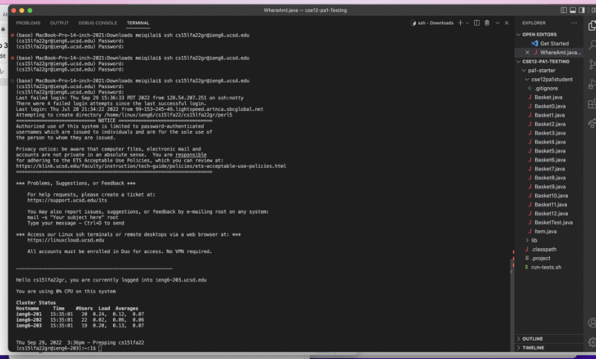
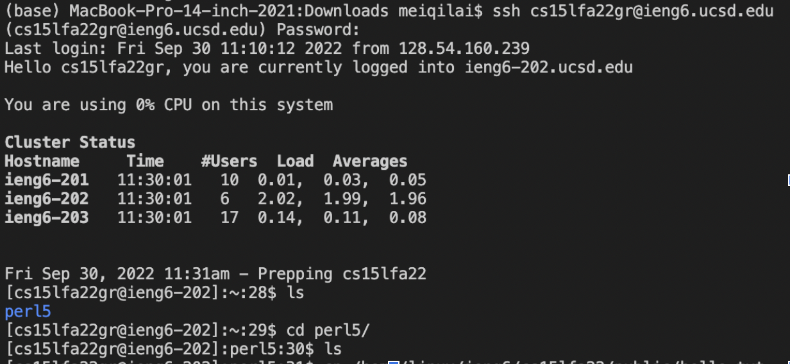
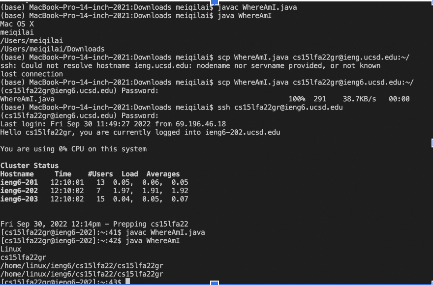
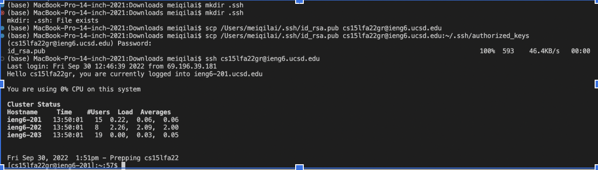
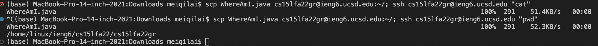

# Topic: Remote Access

1) **Installing VSCode**

First go to https://code.visualstudio.com/ and install it. Click on the button that is most appropriate (Mac or Windows).  When you open the application, it should read Visual Studio Code, new file, open, or clone git repository. In my case, I already had a file open which is why the screenshot looks like that. 

2) **Remotely Connecting**

To remotely connect to a computer, you are going to find your username on the sdacs website. Once you change your password, input "ssh cs15lfa22zz@ieng6.ucsd.edu" and the zz should be replaced with what your username consists of. Enter yes and then put in your password. 

3) **Trying Some Commands**

Here, I used the ls function which is supposed to list what files you have in that specific directory. perl5 posted meaning that is one of the files. cd displays the name of the current directory

4) **Moving Files with SCP**

Moving files with scp means to make a copy of a file from a computer to the remote server you are connected to. Type: "scp WhereAmI.java cs15lfa22zz@ieng6.ucsd.edu:~/" and you will be asked to enter a password. Test this by typing javac <file name>. java and java <file name> in the terminal of the server to see if the file copied over.

5) **Setting an SSH Key**

Setting an SSH Key is helpful becasue every time you open the server, you would have to retype in one's password. The whole point of ssh-keygen is to create a pair of files which are referred to as public key and private key. The public key would then be copied to a certain location on the server. As for the private key, it is also stored in a place on the clients computer. 

6) **Optimize Remote Running**

To optimize remote running, it means to make your life easier by combining multiple lines of code into one single line, separated by semicolons. This command would copy the WhatAmI file to the directory of the server and then go into the server and display the currenty directory(function of pwd)
