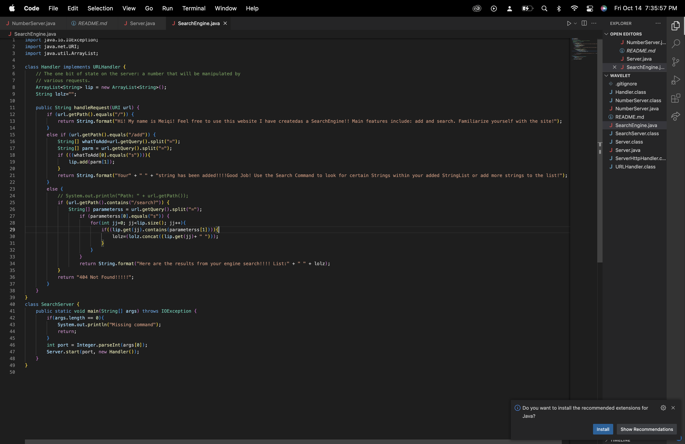
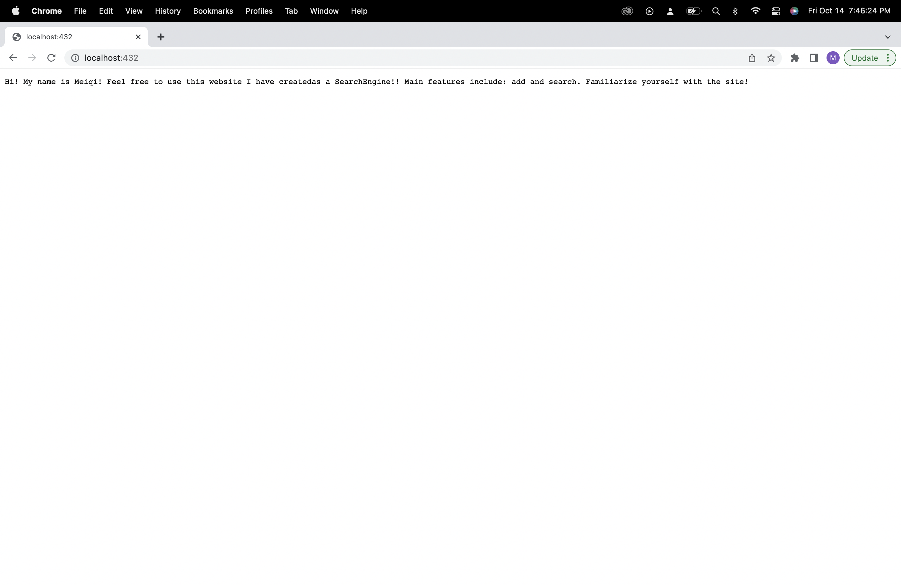
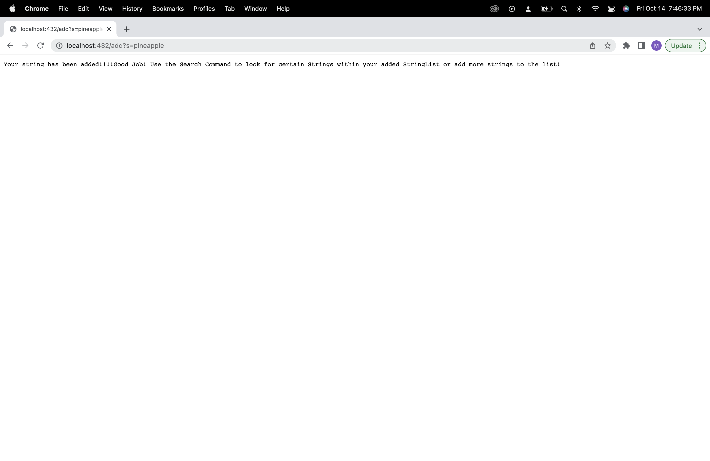
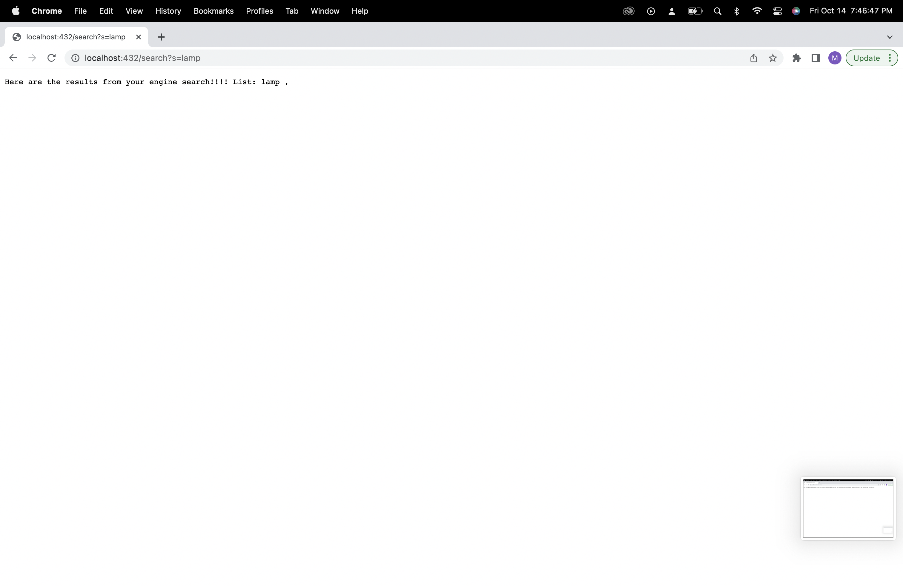
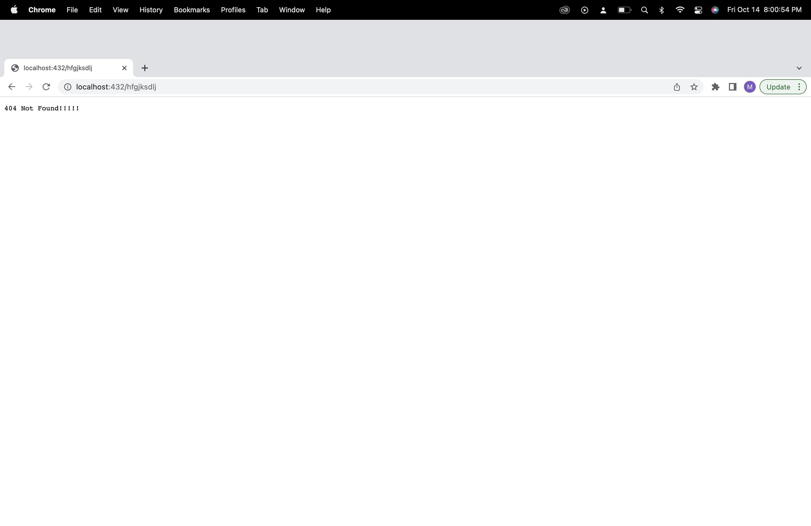
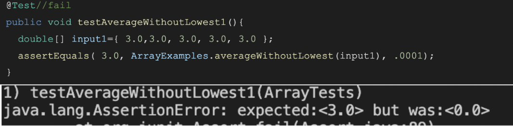
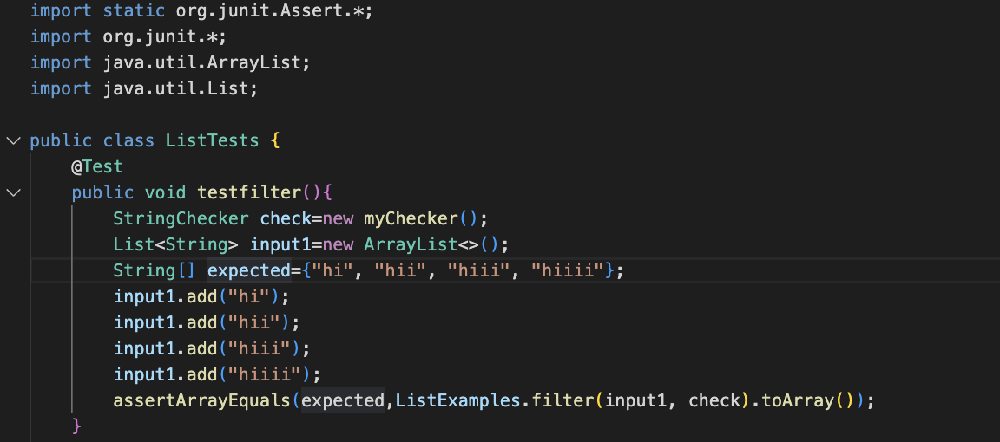
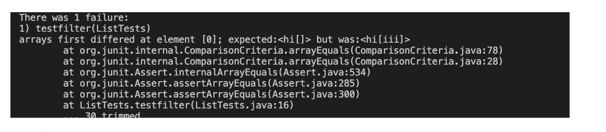

# Lab Report 2 (Week3) 
## By- Meiqi Lai

## Part 1: 
Code: 

## Use of the handleRequest method 

### HOMEPAGE
'        if (url.getPath().equals("/")) {
            return String.format("Hi! My name is Meiqi! Feel free to use this website I have createdas a SearchEngine!! Main features include: add and search. Familiarize yourself with the site!");
        }
The code above allows for the words to print on the website. The first if statement in the handleRequest method is true and allows for the print of the Welcome message. This url contains no specific arguments, basically implying that it is the homepage. The handleRequest method takes in a url of type URI. The url is checked by all the if statements within the method 

### ADDING STRINGS INTO THE ARRAYLIST

'        else if (url.getPath().equals("/add")) {
            String[] whatToAdd=url.getQuery().split("=");
            String[] parm = url.getQuery().split("=");
            if (((whatToAdd[0].equals("s")))){
                lip.add(parm[1]);
            }
            return String.format("Your" + " " + "string has been added!!!!Good Job! Use the Search Command to look for certain Strings within your added StringList or add more strings to the list!");
        } '
The code above allows for these words to be displayed on the website. The else if condition is true because the url in the search bar contains "/add". Because it contains that specific command, the code will use the split function to split the url at the equal sign. After splitting the url, the code will add the first index after the equal sign (index1) into a new string arraylist. The words that go after the equal sign will be turned into strings, when they are added to the arraystring list. The values cannot be numerical values because the code will only put Strings into the arrayStringList and not integers. 

### Search Query

'        else {
            // System.out.println("Path: " + url.getPath());
            if (url.getPath().contains("/search")) {
                String[] parameterss = url.getQuery().split("=");
                    if (parameterss[0].equals("s")) {
                        for(int jj=0; jj<lip.size(); jj++){
                            if(lip.get(jj).contains(parameterss[1])){
                                lolz=lolz.concat((lip.get(jj)+ " "));
                            }
                        }
                    }
                    return String.format("Here are the results from your engine search!!!! List: "  + lolz + ",");
            }'

The code above will display that specific message on the site. What this else statement does is if the url contains "/search" it would split the url at the equal sign once again. Once it is split, it will check to see if the zero index of it contains the character string "s". If it does, it would look through the originally create array String list with the added strings and search to see if any of the strings contain the string that is in index1 of the url. If a string is found, it would return that int he statement displayed to the user. 

## None Found

In the picture displayed above, it reveals a statement that says "404 Not Found!". This statement is printed when none of the conditional statements (if, else if, else) are met. When the values that are inputted after the original url do not match any of the ones that are in the conditional statements, then an error message will pop up. 

## Part2:

Bug 1: (From ArrayTests.java)

Error was that when the lowest number were to be the same as the other numbers in the array, it would return 0 even though the array length was greater than 2. I added another if statement in the case that the number ==lowest, it would also have the condition to check if the array length is greater than 2. If so, the number would be added to the sum. In the end, I would subtract the lowest from the sum. There is this particular symptom for this particular input because the lowest number is the only numberical value in the array. 

Fixed Bug1: 
'  static double averageWithoutLowest(double[] arr) {
    if(arr.length < 2) { return 0.0; }
    double lowest = arr[0];
    for(double num: arr) {
      if(num < lowest) { lowest = num; }
    }
    double sum = 0;
    for(double num: arr) {
      if(num!=lowest) { sum += num; }
      if(num==lowest && arr.length>2) { 
        sum += num; 
      }
    }
    sum-=lowest;
    return sum / (arr.length - 1);
  }'

  Bug 2: (From ListTests.java)
  
  The strings that are being checked are not being added to the arrayList in the correct order They are being added to the beginning if the boolean comes out to be true. In addition to that, The symptom is shown in the image displayed below. This error would happen to all different types of strings being added to the string arraylist simply because the code that is placing the items in order is wrong. In addition to that, the while loop forces there to be an infinite loop. Normally, one's loop would stop or end right when the index is larger than the list. However, the list and index both increase simultaneously. 
    

Fixed bug:
'  static List<String> filter(List<String> list, StringChecker sc) {
    List<String> result = new ArrayList<>();
    int num=0;
    for(String s: list){
      if (sc.checkString(s)){
        result.add(num,s);
        num++;
      }
    }
    return result;
  }'

