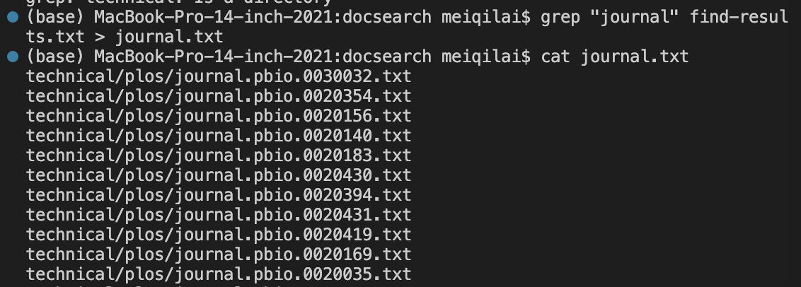
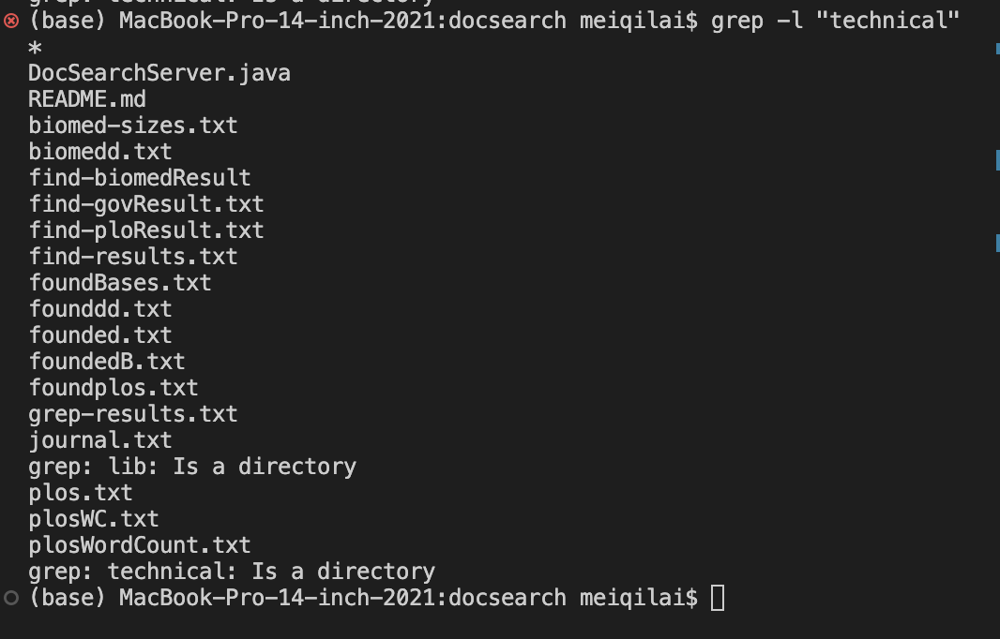
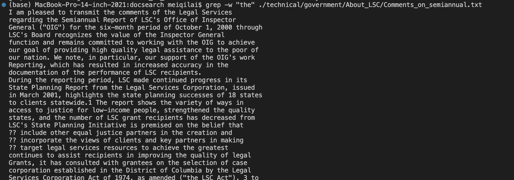
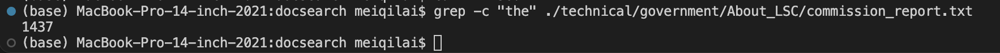
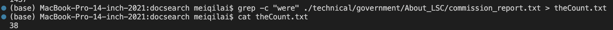

# Lab Report 3 (Week5) 
## By- Meiqi Lai

For this lab report, I researched about grep command line options! 

### Using grep -l :

Example 1: 
In the example below, I used grep -l to find file names that contain "journal" in the list of file names in the "find-results.txt" file. This is useful when you are trying to find a list of files with a specific keyword. After searching through the list of files and finding the ones with "journal" in it, I created a separate text file to store all of these file names. I used the cat command to display all the files that were placed into the text file. 
>

Example 2: 
In the example below, I used grep-l to find file names that contain the word "technical" in all the files found in the directory DOCSEARCH. This is useful because it helps you look through the entirety of the directory.
> 

Example 3: 
In the example below, I used grep-l to find file names that contained the word "UCSDDDDD". None of the files contained the word and as a result, nothing was returned. Grep is useful becasue it allows you to find words that could contain a part of that word. It does not have to start or end with that specific phrase in the quotations. 
> 

### Using grep - w:

Example 1: 
In the example below, I used grep-w to find lines that contained the word "the". The returned output is the string that contains the word inputted. This is useful because it's different than grep-l in the way that it looks for the specific word. It does not return lines that contain a substring with "the". It returns lines with strictly "the". 
> 

Example 2: 
In the example below, I used grep-w to find lines that contained the word "fkdgjahsfjdksah". Nothing is returned because no lines in the file contain "fkdgjahsfjdksah". 
> 

Example 3: 
In the example below, I used grep-w to find words with "jour". Even though there are terms with journal that contains "jour", it does not return that line because -w only finds terms with that specific word. For this exmaple, all the lines that are found with that word are put into the new file created named "withJour.txt". Since no lines were found, nothing is returned when I use the cat command for that new file.
> 

### Using grep - c:
Example 1: 
In the example below, I used grep-c to count the number of times that "the" appears in the file: commission_report.txt. This is useful when you want to count how many times a certain word appears in the file. 
> 

Example 2: 
In the example below, I used grep-c to count the number of times that "were" appears in the file: commission_report.txt. After using the grep-c command, the number of times the word appears would be stored in a newly created file called "theCount.txt". After storing the number in the file, I used the cat command to display the number in the terminal. 
> 

Example 3: 
In the example below, I used the grep-c command to count the number of times that "CSE15" appeared in the file: commission_report.txt. The number returned is 0 because CSE15 does not appear anywhere in the file. 
> 