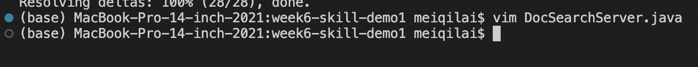

# Topic:  Vim Commands
## Lab Report 4
### Completed by: Meiqi Lai

## Part1
For part 1, I decided to do the first bulletpoint: 

"In DocSearchServer.java, change the name of the start parameter of getFiles, and all of its uses, to instead be called base."

1) Make sure you are in the correct directory in which you git cloned the files to. In the picture below, it is cloned to week6-skill-demo1

2) vim D

3) <TAB<TABB>>

4) <Return<etur>>
This screenshot shows how by putting the vim D + tab function into place, you would save yourself time from typing the long file name.

5) /start
Using the /start command would search for "start" in the file

7) ce
Using ce puts you into insert mode

8) base <<esc>esc>
Typing base changes the start word to base

10) n. 
Repeats the same command but for another "start" word that is found in the file

11) n.
This screenshot shows that all the "starts" have been changed to base

12) :wq

13)<<Return<etur>>
This screenshot puts the :wq command into place and returns to the terminal mode. 
 

## Part2
Option1: 1 minute 
Option2: 1 minute and 10 seconds

1) I would prefer use VSCode and then copying over the file because I am more familiar with using VSCode. Editing directly on the remote server is still very new to me. However I feel like it would be a lot faster than copying over the file because that does take up some time. 

2) I feel like if I were to be working with large/long files, I would still prefer to use VSCode simply because I am already familiar with it. As I become more familiar with vim, I think I would prefer it over VSCode. 