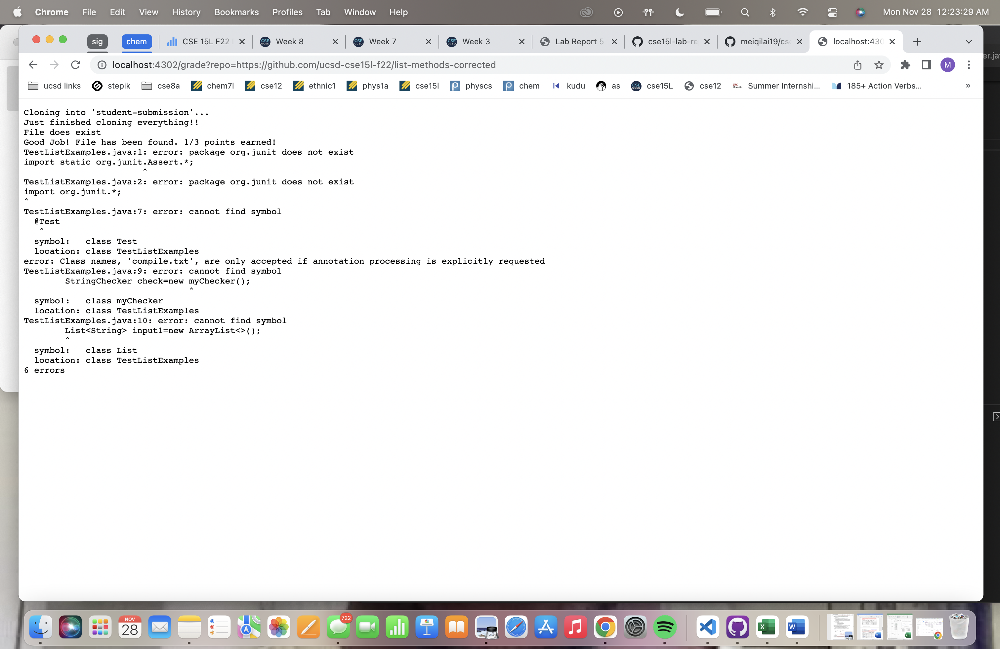
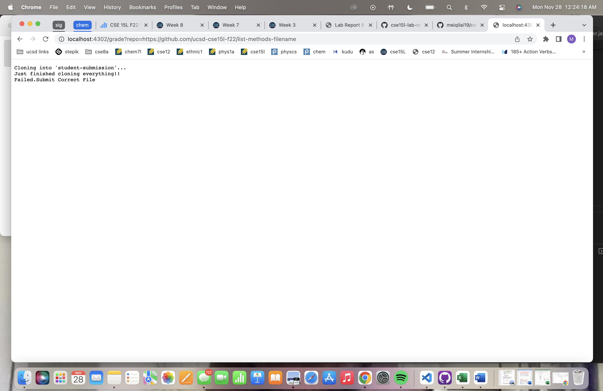

# Topic: Grading Script
## Lab Report 5
### Completed by: Meiqi Lai

```
# Create your grading script here!!

set -e

rm -rf student-submission

mkdir student-submission
git clone $1 student-submission
echo "Just finished cloning everything!! 1/3"

cp TestListExamples.java student-submission
cd student-submission
# if [! -f "ListExamples.java"]; then
#     echo "File does not exist. Resubmit a new file to get 1/3.";
#     exit
#     fi

if [ -f "ListExamples.java" ] 
then
    echo "File does exist"
    echo "Good Job! File has been found. 2/3 points earned! "
else    
    echo "Failed.Submit Correct File"
    exit
fi

javac -cp .:lib/hamcrest-core-1.3.jar:lib/junit-4.13.2.jar *.java compile.txt
    if [$? -eq 0] 
    then 
        echo "Congratulations!!!! All your tests have passed. "
        echo "3/3 points"
        cat testOutput.txt
        exit
    else 
        echo "The test that has been passed in has failed. Fix file to attempt to get more points"
        cat testOutput.txt
        fi

java -cp .:lib/hamcrest-core-1.3.jar:lib/junit-4.13.2.jar org.junit.runner.JUnitCore TestListExamples >out.txt 2> error.txt
cd student-submission
    if [$? -eq 0] 
    then
        echo "ALLL TESTS PASSED! conrgatulations! All points have been obtained. 100%"
    
    else
        echo "last Test has been failed. Try again!"
fi

```

## Screenshot 1: Compile Error


## Screenshot 2: All methods found


## Screenshot3: Wrong File Name


I chose to do the wrong File name example. First a new directory was created called "student-submission". The file is then cloned which then echoes "Just finished cloning everything!! 1/3". Next, it goes into the student-submission and changes directory to that. Next, the file is checked to see if the correct file is submittied. The if statement is true in this case which is why the return code was 0 because nothing happened afterwards. There was no standard output or standard error. Since the file name is wrong, the system just exits and stops running.

Thank you for all your hardwork!! Very appreciated!!